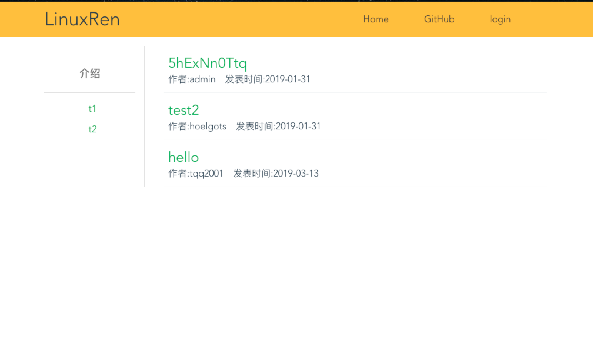
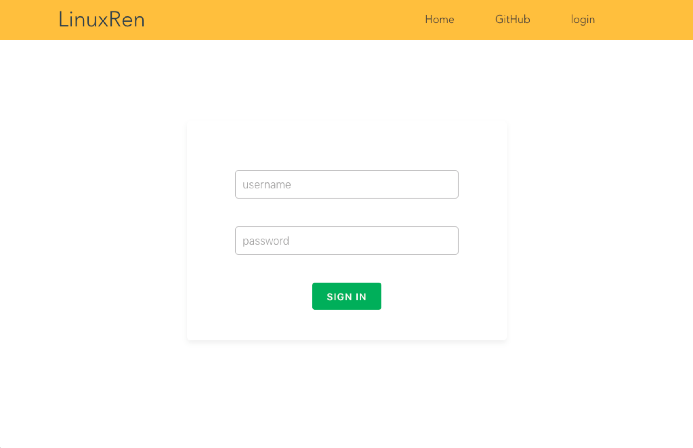
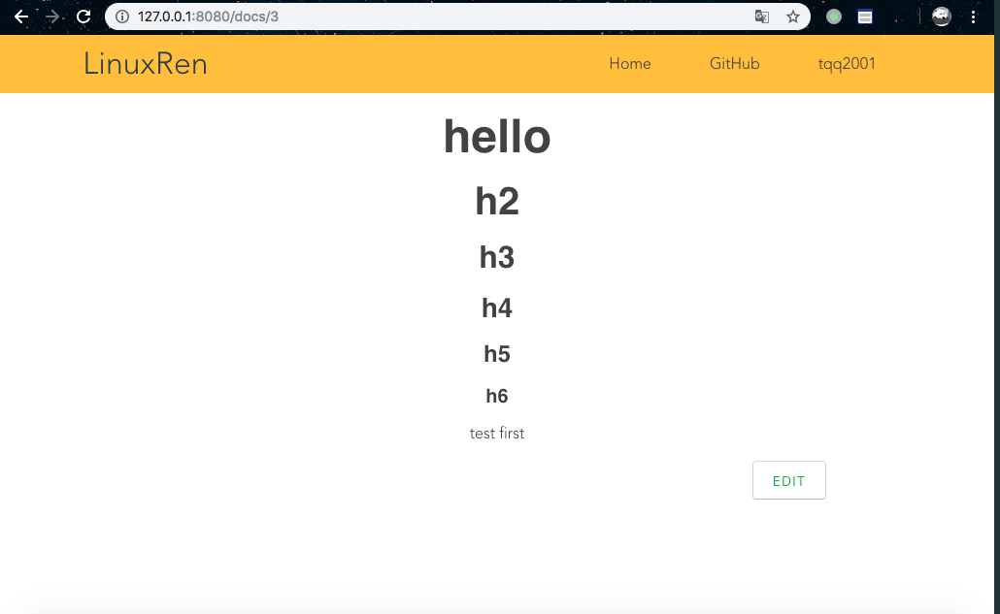
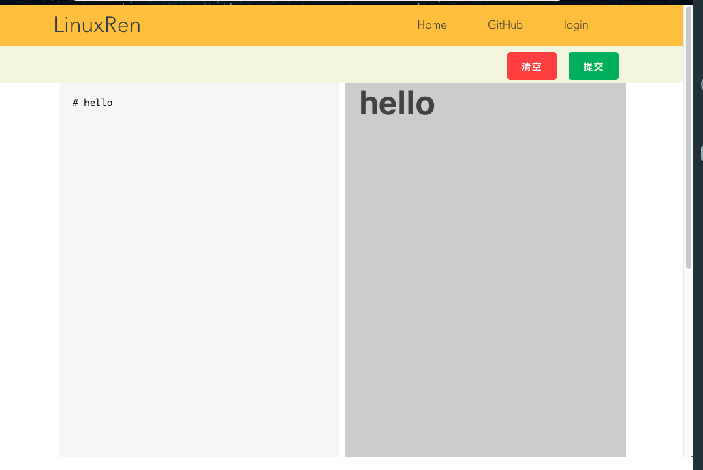

# linuxren wiki website
后端:`Django`+`DRF`  
前端:`vue`  
数据库:`mysql`  
## 介绍
为`linuxren`社区所做的`wiki`站点的  
使用`蝉知`的`User`表(需要建立一个视图  
`restful`架构  
使用`jwt`来代替`session`  

##前端
使用vue构建  
`vue-route`进行路由控制
`vuex`控制登陆状态
支持`markdown`
主页 

登录界面

文章

编辑界面

## 数据库
需要建立一个蝉知的user表的views
名字叫做`wiki_user`
```sql
create view wiki_user as
select `chanzhi`.`eps_user`.`account` AS `account`, `chanzhi`.`eps_user`.`password` AS `password`
from `chanzhi`.`eps_user`;
```
## 测试
由于`django`的`model`无法建立视图  
需要在建立测试数据库后手动添加`user`的视图  
然后运行:
```shell
python manage.py test api --keepdb
```